# Omarchy Yazi

<p align="center">
  <a href="https://omarchy.org" target="_blank">
    
  </a>
  <a href="https://github.com/joaofelipegalvao/omarchy-yazi/blob/main/LICENSE" target="_blank">
    
  </a>
  <a href="https://github.com/joaofelipegalvao/omarchy-yazi/blob/main/docs/INSTALL.md" target="_blank">
    
  </a>
  <a href="https://github.com/joaofelipegalvao/omarchy-yazi/blob/main/docs/ARCHITECTURE.md" target="_blank">
    
  </a>
  <a href="https://github.com/joaofelipegalvao/omarchy-yazi/releases" target="_blank">
    
  </a>
</p>

<div align="center">
  
Yazi themes that automatically sync with <a href="https://omarchy.org">Omarchy</a> theme changes — **with persistent per-theme customization**.

  <table>
  <tr>
    <td align="center">
      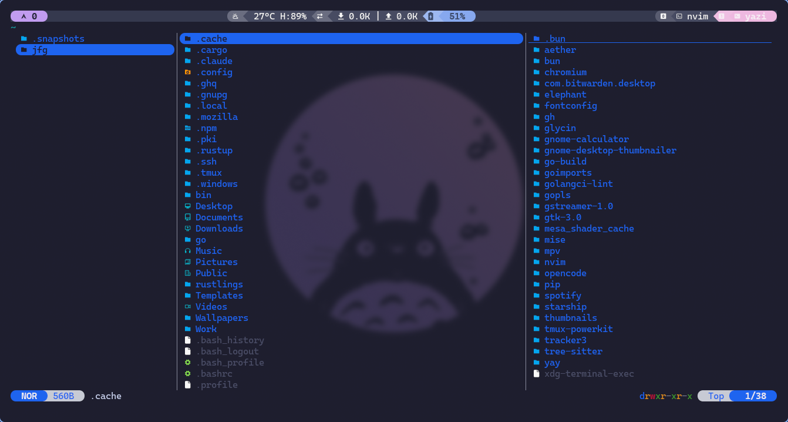
      <br/>
      <sub><b>Catppuccin Macchiato</b></sub>
    </td>
    <td align="center">
      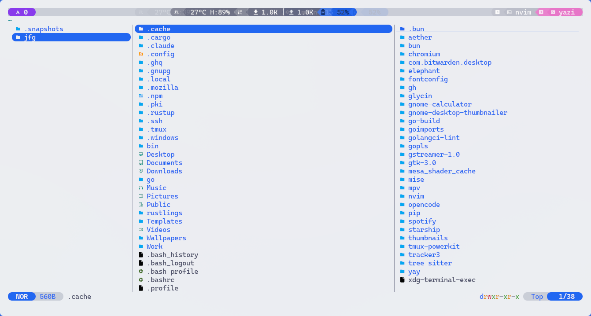
      <br/>
      <sub><b>Catppuccin Latte</b></sub>
    </td>
  </tr>
  <tr>
    <td align="center">
      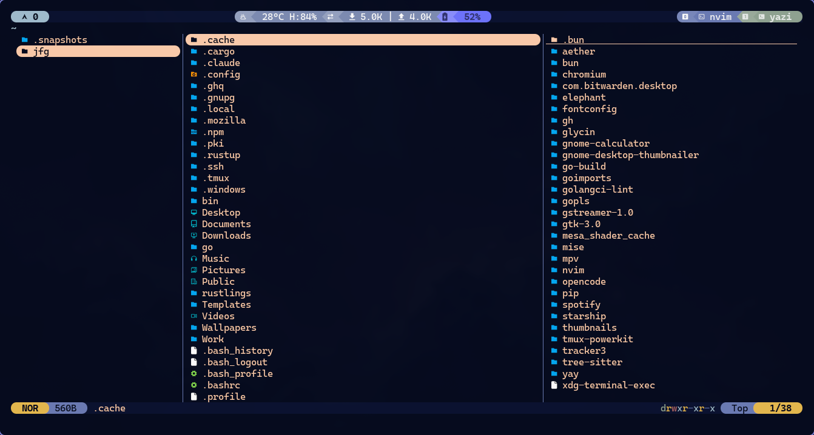
      <br/>
      <sub><b>Ethereal</b></sub>
    </td>
    <td align="center">
      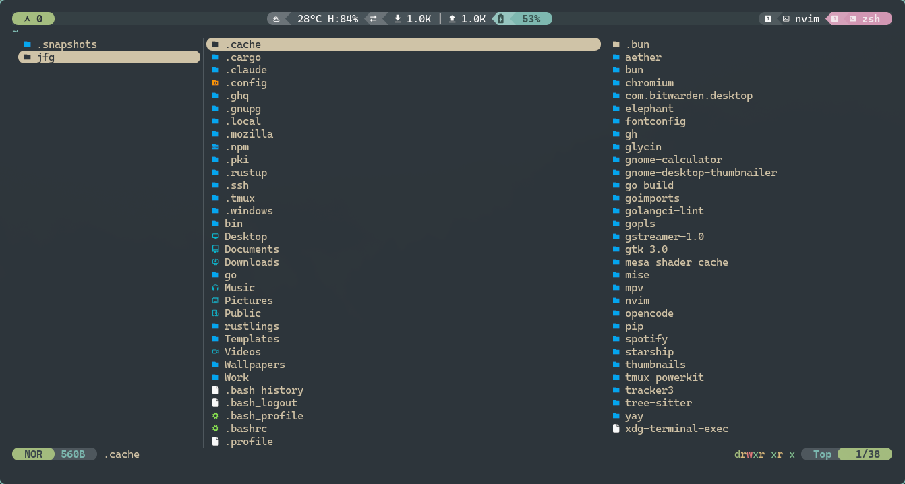
      <br/>
      <sub><b>Everforest Dark</b></sub>
    </td>
  </tr>
  <tr>
    <td align="center">
      
      <br/>
      <sub><b>Flexoki Light</b></sub>
    </td>
    <td align="center">
      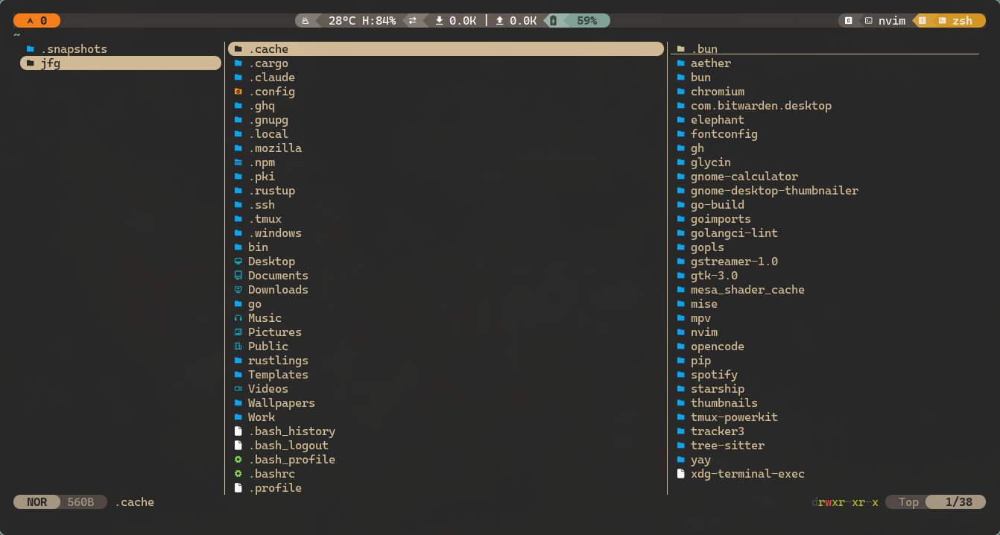
      <br/>
      <sub><b>Gruvbox Dark</b></sub>
    </td>
  </tr>
  <tr>
    <td align="center">
      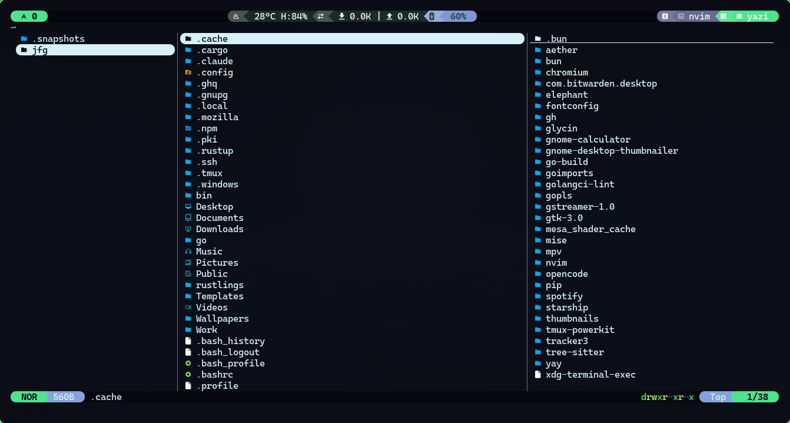
      <br/>
      <sub><b>Hackerman</b></sub>
    </td>
    <td align="center">
      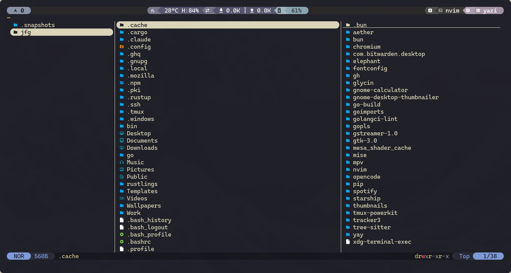
      <br/>
      <sub><b>Kanagawa</b></sub>
    </td>
  </tr>
  <tr>
    <td align="center">
      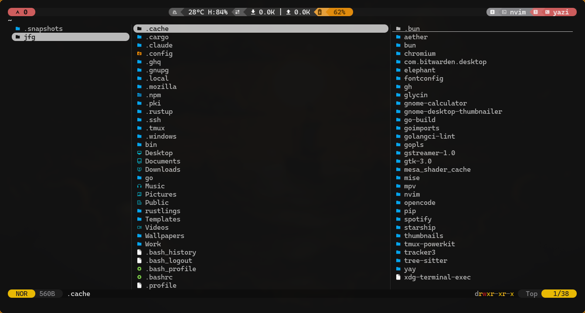
      <br/>
      <sub><b>Matte Black</b></sub>
    </td>
    <td align="center">
      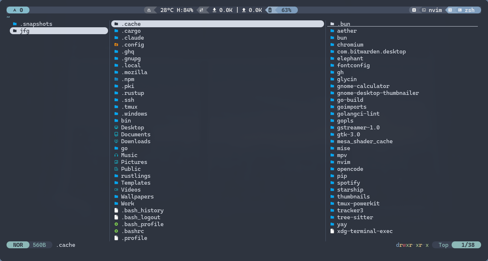
      <br/>
      <sub><b>Nord</b></sub>
    </td>
  </tr>
  <tr>
    <td align="center">
      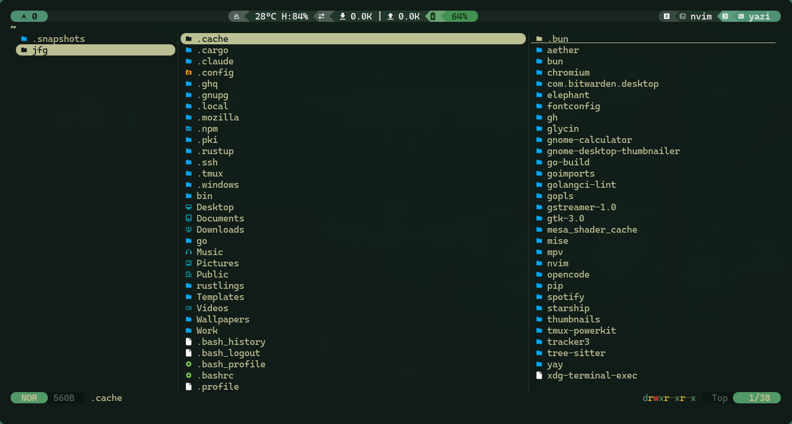
      <br/>
      <sub><b>Osaka Jade</b></sub>
    </td>
    <td align="center">
      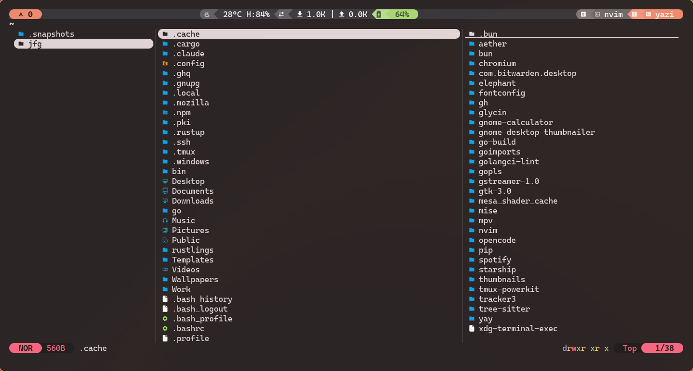
      <br/>
      <sub><b>Ristretto</b></sub>
    </td>
  </tr>
  <tr>
    <td align="center">
      
      <br/>
      <sub><b>Rose Pine Dawn</b></sub>
    </td>
    <td align="center">
      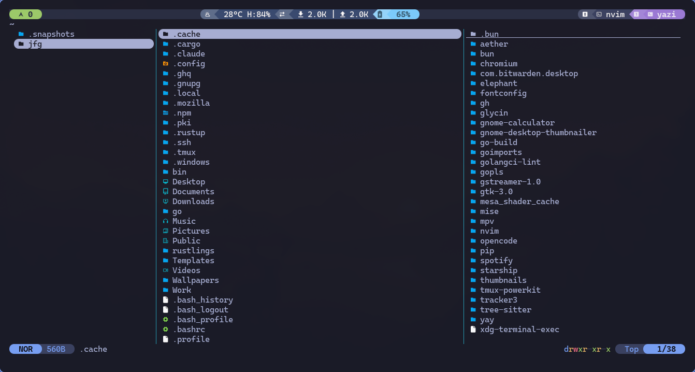
      <br/>
      <sub><b>Tokyo Night</b></sub>
    </td>
  </tr>
</table>

</div>

## ✨ What's New in v2.0

- 🎨 **Persistent Theme Profiles** - Your customizations survive theme switches
- 📁 **Clean Architecture** - Separation between templates and your configs
- 🔄 **Smart Theme Detection** - Works with Omarchy 3.3+ `theme.name` file
- 🎯  **Native support** - All 14 default Omarchy themes sync
- 🚀 **Zero Config** - Works out of the box

## Features

### Persistent Customization

Edit `~/.config/yazi/omarchy-themes/THEME.toml` and your changes **persist** when you switch back to that theme.

### Automatic Synchronization

Switch Omarchy themes with `Super + Ctrl + Shift + Space` — Yazi updates instantly.

### Intelligent Fallbacks

Missing a theme variant? The installer automatically finds the closest match.

### Clean Separation

```
~/.local/share/omarchy-yazi/themes/     ← Template repository (read-only)
~/.config/yazi/omarchy-themes/          ← Your persistent profiles (editable)
~/.config/yazi/theme.toml               ← Symlink to active theme
```

## Quick Start

```bash
curl -fsSL https://raw.githubusercontent.com/joaofelipegalvao/omarchy-yazi/main/scripts/omarchy-yazi-install.sh | bash
```

Then restart Yazi to see your current Omarchy theme applied.

> **Security Tip**: Always review scripts before running. See [Installation Guide](docs/INSTALL.md) for manual installation.

## Requirements

- [Omarchy](https://omarchy.org) (version 3.3+)
- [Yazi](https://github.com/sxyazi/yazi) (latest version recommended)
- `git`

## Supported Themes

<details>
<summary><strong>All Omarchy themes are supported (click to expand)</strong></summary>

**Fully Supported:**

- Catppuccin (macchiato, latte)
- Rose Pine (dawn)
- Tokyo Night (night)
- Gruvbox (dark)
- Everforest (dark)
- Kanagawa (dragon)
- Flexoki (light)
- Nord, Ethereal, Osaka-jade, Hackerman
- Matte-black, Ristretto

</details>

## How It Works (v2.0)

```
User switches theme (Super+Ctrl+Shift+Space)
         ↓
Omarchy hook triggers
         ↓
Generator checks: ~/.config/yazi/omarchy-themes/THEME.toml exists?
         ↓
    No → Copy from ~/.local/share/omarchy-yazi/themes/THEME/theme.toml
    Yes → Skip (preserve your customizations!)
         ↓
Update symlink: ~/.config/yazi/theme.toml → omarchy-themes/THEME.toml
         ↓
Clear Yazi cache
         ↓
✨ Theme applied on next Yazi launch
```

## Documentation

- **[Installation Guide](docs/INSTALL.md)** - Step-by-step installation
- **[Architecture v2.0](docs/ARCHITECTURE.md)** - How the new system works
- **[Customization Guide](docs/CUSTOMIZATION.md)** - Personalize your themes
- **[Troubleshooting](docs/TROUBLESHOOTING.md)** - Common issues and solutions

## Customization Example

Edit your theme profiles directly:

```bash
# Edit Tokyo Night theme
nvim ~/.config/yazi/omarchy-themes/tokyo-night.toml

# Edit Hackerman theme  
nvim ~/.config/yazi/omarchy-themes/hackerman.toml
```

Your changes persist! Switch to another theme and back — your customizations remain.

## Uninstall

### Remove everything

```bash
curl -fsSL https://raw.githubusercontent.com/joaofelipegalvao/omarchy-yazi/main/scripts/omarchy-yazi-uninstall.sh | bash
```

### Keep your theme profiles

```bash
curl -fsSL https://raw.githubusercontent.com/joaofelipegalvao/omarchy-yazi/main/scripts/omarchy-yazi-uninstall.sh | bash -s -- --keep-configs
```

## Migration from v1.x

If you're upgrading from v1.x:

1. **Your old configs are safe** - They're in `~/.config/omarchy/themes/*/theme-yazi.toml`
2. **Run the new installer** - It will create the new structure
3. **Optional cleanup** - Remove old configs in Omarchy themes directory (not needed anymore)

See [Migration Guide](docs/MIGRATION.md) for details.

## Contributing

Contributions are welcome! Please:

1. Fork the repository
2. Create a feature branch (`git checkout -b feature/amazing-feature`)
3. Test thoroughly with multiple themes
4. Submit a pull request

### Adding New Themes

1. Create `themes/YOUR_THEME/theme.toml` in the repository
2. Test with the installer
3. Submit PR with theme file and screenshots

## Acknowledgments

- Thanks @dhh for [Omarchy](https://omarchy.org)
- [Yazi](https://github.com/sxyazi/yazi) - Blazing fast terminal file manager
- Community theme creators and contributors

## License

MIT License - see [LICENSE](LICENSE) for details

---

**Architecture Note**: This repository uses XDG Base Directory specification:

- `~/.local/share/omarchy-yazi/` - Application data (templates)
- `~/.config/yazi/` - User configurations (editable)
- `~/.local/bin/` - User executables (scripts)

Your customizations are always preserved in `~/.config/yazi/omarchy-themes/`.
