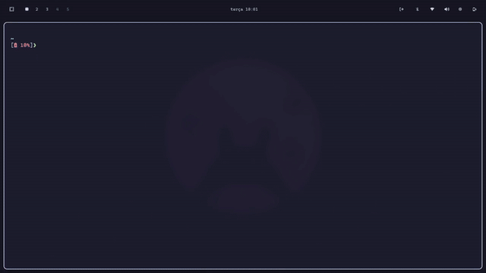

# Omarchy Yazi

<p align="center">
  <a href="https://omarchy.org" target="_blank">
    
  </a>
  <a href="https://github.com/joaofelipegalvao/omarchy-yazi/blob/main/LICENSE" target="_blank">
    
  </a>
  <a href="https://github.com/joaofelipegalvao/omarchy-yazi/blob/main/docs/INSTALL.md" target="_blank">
    
  </a>
  <a href="https://github.com/joaofelipegalvao/omarchy-yazi/blob/main/docs/HOW_IT_WORKS.md" target="_blank">
    
  </a>
  <a href="https://github.com/joaofelipegalvao/omarchy-yazi/releases" target="_blank">
    
  </a>
</p>

<div align="center">
  
Yazi themes that automatically sync with <a href="https://omarchy.org">Omarchy</a> theme changes.



<p align="center"><em>Watch how Yazi automatically updates when switching Omarchy themes with <code>Super + Ctrl + Shift + Space</code></em></p></div>

## Features

- All 12 Omarchy themes supported
- Automatic theme synchronization via hooks
- Seamless integration with Yazi
- Auto-detects theme variants (catppuccin-latte, tokyo-night, etc.)
- Clean installation and uninstallation

## Quick Start

```bash
curl -fsSL https://raw.githubusercontent.com/joaofelipegalvao/omarchy-yazi/main/scripts/omarchy-yazi-install.sh | bash
```

Then restart Yazi to see your current Omarchy theme applied.

> **Security Tip**: Always review scripts before running. See [Installation Guide](docs/INSTALL.md) for manual installation.

## Requirements

- [Omarchy](https://omarchy.org) (version 3.1+)
- [Yazi](https://github.com/sxyazi/yazi)
- `git`

## Documentation

- **[Installation Guide](docs/INSTALL.md)** - Detailed installation instructions and configuration
- **[How It Works](docs/HOW_IT_WORKS.md)** - Architecture and technical details
- **[Troubleshooting](docs/TROUBLESHOOTING.md)** - Common issues and solutions

## Quick Configuration

### Manual Reload

If you want to manually reload Yazi's theme:

```bash
# Yazi will automatically pick up theme changes on next launch
yazi
```

Or kill and restart any running Yazi instances:

```bash
killall yazi
yazi
```

## Uninstall

```bash
curl -fsSL https://raw.githubusercontent.com/joaofelipegalvao/omarchy-yazi/main/scripts/omarchy-yazi-uninstall.sh | bash
```

To keep theme configs but remove the plugin:

```bash
curl -fsSL https://raw.githubusercontent.com/joaofelipegalvao/omarchy-yazi/main/scripts/omarchy-yazi-uninstall.sh | bash -s -- --keep-configs
```

## Contributing

Contributions are welcome! Please:

1. Fork the repository
2. Create a feature branch
3. Test thoroughly
4. Submit a pull request

## Acknowledgments

- Thanks @dhh for [Omarchy](https://omarchy.org)
- [Yazi](https://github.com/sxyazi/yazi) - Blazing fast terminal file manager
- Community theme creators

---

**Note**: This plugin does not modify Omarchy's core files (in `~/.local/share/omarchy`). All configurations are stored in user-editable locations (`~/.config`).
